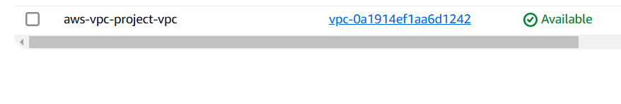
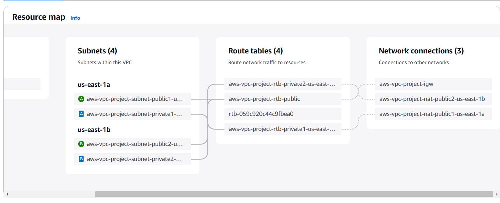
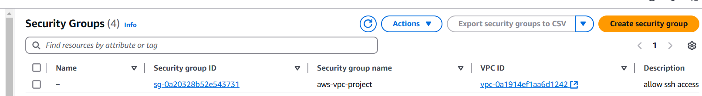
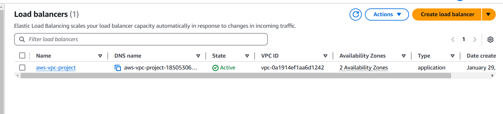
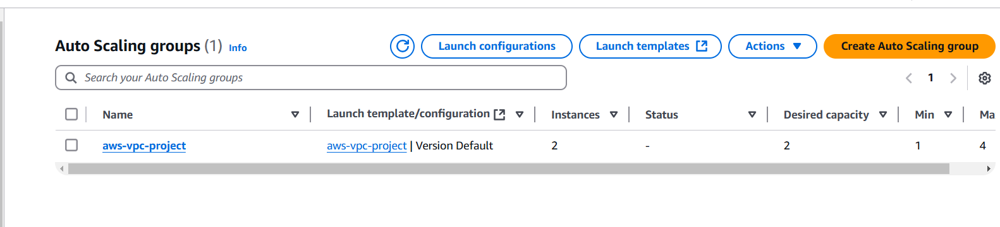
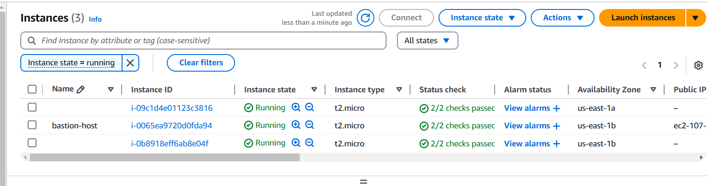
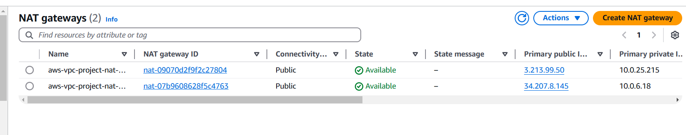
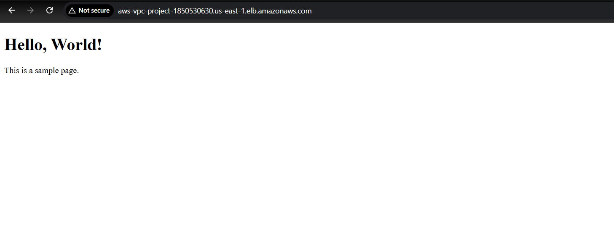

# AWS VPC with servers in private subnets and NAT
## Architecture Overview

The following diagram provides an overview of the resources included in this example.  
The VPC has public subnets and private subnets in two Availability Zones. Each public subnet contains a **NAT gateway** and a **load balancer node**.  

The servers run in the **private subnets**, are launched and terminated by using an **Auto Scaling group**, and receive traffic from the **load balancer**.  

The servers can connect to the internet by using the **NAT gateway**. The servers can connect to **Amazon S3** by using a **gateway VPC endpoint**.

## AWS Setup Screenshots

### 1. VPC Creation

### 2. Subnets & Router tableConfiguration

### 3. Security Groups

### 4. Load Balancer Setup

### 5. Auto Scaling

### 6. Bastion Host & Servers

### 7. NAT Gateways

### 8. Final Output

## Conclusion

This project demonstrates the setup of a secure and scalable AWS VPC infrastructure with private and public subnets, NAT gateways, Auto Scaling, and a bastion host. The architecture ensures controlled internet access while maintaining high availability and security. By following this setup, users can efficiently deploy and manage workloads in a cloud environment.

## References

For more details on setting up and cleaning up NAT Gateways and private subnets, check the official AWS documentation:  

🔗 [AWS VPC Example – Private Subnets with NAT](https://docs.aws.amazon.com/vpc/latest/userguide/vpc-example-private-subnets-nat.html#clean-up-private-subnets)

