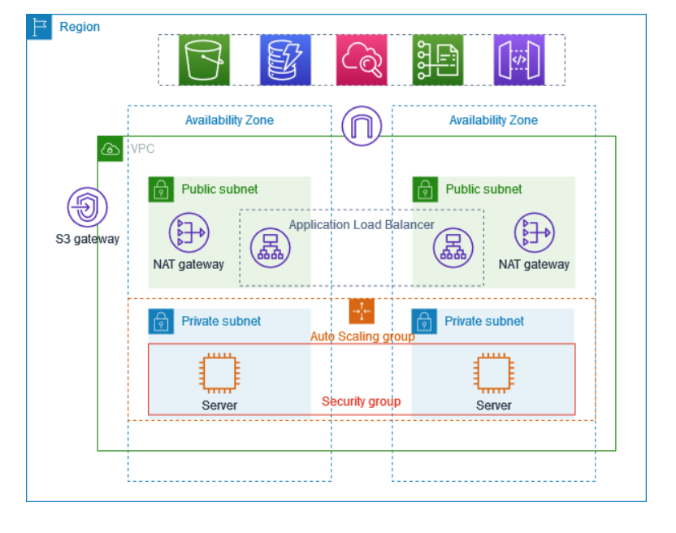

# AWS_VPC
## Architecture Overview

The following diagram provides an overview of the resources included in this example.  
The VPC has public subnets and private subnets in two Availability Zones. Each public subnet contains a **NAT gateway** and a **load balancer node**.  

The servers run in the **private subnets**, are launched and terminated by using an **Auto Scaling group**, and receive traffic from the **load balancer**.  

The servers can connect to the internet by using the **NAT gateway**. The servers can connect to **Amazon S3** by using a **gateway VPC endpoint**.

